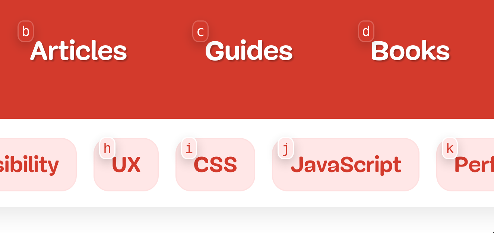

  

# Rango

Rango is a cross browser extension that helps you interact with web pages using your voice and [talon](https://talonvoice.com/). It does this by drawing hints with letters next to elements that you can use to click, hover, copy or show link adresses and many more features to come.

  

## Installation

In order to use the extension you need two pieces: the extension and the talon files.

You can download the talon files from [here](https://github.com/david-tejada/rango-talon). Clone or download them to your talon user folder.

### Firefox

You can install the extension through Firefox Add-ons (available soon)

### Chrome and Chromium Browsers

Due to [this issue](https://github.com/david-tejada/rango/issues/5) I am not able to submit the extension to the Chrome Web Store. So it has to be loaded manually. There are two ways to do this:

#### Download the Zip File

- Download the latest release from [here](https://github.com/david-tejada/rango/releases)
- Extract the contents
- Go to [chrome://extensions/](chrome://extensions/), enable `developer mode`, click `load unpacked`, go into the folder that you just extracted and click open.

The downside of this method is that you have to do that every time you want to update the extension.

#### Build From Source

- Clone this repository: `git clone https://github.com/david-tejada/rango`
- cd into it: `cd rango`
- Install with npm: `npm install`
- Build: `npm run build`
- Go to [chrome://extensions/](chrome://extensions/), enable `developer mode`, click `load unpacked`, go into the `dist` folder that you just build and click open.

Once you have done this in order to update you just have to:

- Update your repo: `git pull`
- Install with npm: `npm install`
- Build: `npm run build`

You can automate the update process with a shell script.

It's possible that you see some errors after adding the extension manually, just ignore them. The extension will work fine.

## Usage

There are two modes: direct and explicit clicking. To switch between them you have to used the command `rango direct` or `rango explicit`.

### Direct Clicking

This is the default mode. With it enabled you just have to say the characters to click an element. To avoid misclicks it only listens to a pause, one or two letters followed by another pause. If you actually want to enter one or two letters you have to use the knausj command `press`

#### Examples

- `a`: Clicks on link with the hint `a`
- `gh`: Clicks on link with the hint `gh`
- `abc`: Enters the characters `abc`
- `press a`: Enters the character `a`

### Explicit Clicking

With explicit clicking you have to precede every hint with word `click`. This mode prevents any misclicks at the expense of being a bit more tedious.

### Other Commands

- `hover <hint>`: It hovers over the element. After 10 seconds the element will be automatically unhovered.
- `hover fix <hint>`: It hovers over the element. The element will not be automatically unhovered.
- `dismiss`: It clears any previously hovered element.
- `show <hint>`: It shows the url address.
- `copy link <hint>`: It copies the url address to the clipboard.
- `blank <hint>`: It opens the link in a new tab.
- `hints toggle`: It shows and hides the hints.

### Customizing Hints Font

At the moment there are no options to customize the way hints appear. Options for that will be added in the future. In the meantime if you find hints font difficult to read you can change the monospace font in the browser settings and the hints will show with that font.
