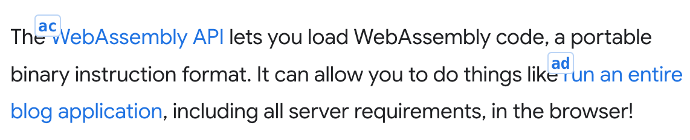

<p align="center">
  
</p>

<p align="center"><strong>Rango</strong></p>

<p align="center">
<a href="http://rango.click">✨ rango.click ✨</a><br>
The cross browser extension
that helps you control your browser by voice.<br>🦎 It blends in! </p>

## Introduction

Rango is a cross browser extension that helps you interact with web pages using
your voice and [Talon](https://talonvoice.com/). It does this by drawing hints
with letters next to elements that you can use to click, hover, copy or show
link adresses. It also helps you scroll, open multiple links in new tabs, close
multiple tabs and more.

<p align="center">
  
</p>

## Sponsorship

Rango is almost entirely the work of one developer. I have spent thousands of
hours making sure Rango works and feels great. I would like to be able to
continue working on Rango to make it even better. To be able to do that I need
your support. If Rango makes your life easier when navigating the web and has
become an essential tool for you, please consider becoming a sponsor.
[Click here](https://github.com/sponsors/david-tejada) or just say <kbd>rango
open sponsor</kbd>.

## Installation

In order to use the extension you need two pieces: the extension and the talon
files.

- The extension can be installed from the respective store:
  [Firefox](https://addons.mozilla.org/en-US/firefox/addon/rango/),
  [Chrome](https://chrome.google.com/webstore/detail/rango/lnemjdnjjofijemhdogofbpcedhgcpmb),
  [Edge](https://microsoftedge.microsoft.com/addons/detail/rango/pcngjebdhphedjkfhipblkgjbjoeaaeb),
  [Safari](https://apps.apple.com/es/app/rango-for-safari/id6461166435?l=en-GB&mt=12).

- (Safari only) In order for Rango to work in Safari you need to first enable it
  in the Safari preferences. Go to Preferences -> Extensions and check Rango on
  the left sidebar. Then you need to click the extension icon in Safari and
  select `Always Allow on Every Website`.

- The talon files can be found in the
  [rango-talon](https://github.com/david-tejada/rango-talon) repository. Clone
  or download them to your talon user folder. **IMPORTANT**: Make sure to clone
  or download the rango-talon repository and not this one.

It is also assumed that you have installed
[talonhub/community](https://github.com/talonhub/community) to your talon user
folder. If not you need at least to have the following captures defined:
`<user.letter>`, `<user.text>`, `<user.number_small>`, `<user.number_string>`
(only if you want to use number hints) and the list `{user.website}`.

<strong style="color: red">IMPORTANT</strong>: Once **rango-talon** has been
added to your talon user folder, Rango will be active for all your browsers. If
you haven't installed the extension itself in a specific browser, it's better to
disable Rango for that browser to avoid unexpected behavior. The best way to do
this is to activate the tag `user.rango_disabled` for that browser. For example,
if you want to disable Rango in Brave and Chrome, you could have a _.talon_ file
anywhere in your talon user folder with the following contents.

```talon
app: brave
app: chrome
-
tag(): user.rango_disabled
```

## Basic Usage

Rango decorates elements with labels. To click an element simply say the letters
for that element. For example, <kbd>air whale</kbd> will click the element with
the label `aw`.

Similarly, you can activate a tab using the keywords <kbd>go tab</kbd> or
<kbd>slot</kbd>. For example, <kbd>go tab air</kbd> or <kbd>slot air</kbd> will
activate the tab with the tab marker `a`.

You can scroll a page using the commands <kbd>upper</kbd> and <kbd>downer</kbd>.
If you want to scroll a sidebar you can use the commands <kbd>upper left</kbd>
and <kbd>downer left</kbd> for the left sidebar and <kbd>upper right</kbd> and
<kbd>downer right</kbd> for the right sidebar.

## Targets

Some commands accept targets. There are two types of targets depending if the
command acts on elements or tabs. In this documentation the targets are denoted
with <kbd>&lt;target&gt;</kbd> for targeting elements on a page and
<kbd>&lt;tab_target&gt;</kbd> for targeting tabs. These are convenience
shorthands used in this documentation. They represent the captures
<kbd>&lt;user.rango_target&gt;</kbd> and
<kbd>&lt;user.rango_tab_target&gt;</kbd> in rango-talon.

### Element Targets

There are three types of element targets: **hint targets**, **reference
targets** and **text search targets**.

#### Hint Targets

Hints are labels with letters (or numbers when
[using number hints](#using-number-for-hints)) that are placed at the top left
of elements. It is the easiest way to refer to an element and the one you will
use most of the time.

<p align="left">
  
</p>

To refer to an element by its hint you simply have to say the letters or numbers
of the hint. For example, to refer to the first link in the above image you
would use <kbd>air gust</kbd>.

If an element you want to click doesn't have a hint you can display
[extra hints](#displaying-extra-hints).

#### Reference Targets

References are a way to refer to an element on a particular webpage by a
previously saved name. You can learn how to create references and use them for
scripting in the section [Custom References](#custom-references).

To refer to a previously saved reference we use the formula <kbd>mark
&lt;text&gt;</kbd>. For example, <kbd>click mark main menu</kbd>.

#### Text Search Targets

We can also refer to an element by its text content. For this we use the formula
<kbd>text &lt;text&gt;</kbd>. For example, <kbd>click text submit</kbd> will
click the element on the viewport whose text context better matches the text
`submit`. To learn more about fuzzy text search take a look at the section
[Fuzzy Text Search](#fuzzy-search-elements).

### Tab Targets

Tab targets are a way to reference tabs by their tab marker. Tab markers are
letters displayed at the start of a tab title. Rango prepends the tab marker to
the title of the tab if the setting `Include tab marker in title` is on
(default). To target a tab you simply have to say the letters of the tab marker.
For example, <kbd>tab close air</kbd>.

### Primitive, List and Range Targets

Targets can be primitive, list or range depending if they act on a single
element, a list of elements or a range of elements.

Most Rango commands accept any of the three types of targets. Although, some of
them, for example `crown <target>`, only accept primitive targets.

#### Primitive Targets

Primitive targets are single targets. They are used by referring to the letters
or numbers with which elements or tabs are labeled. For example, <kbd>air</kbd>,
<kbd>gust harp</kbd> or <kbd>seventeen</kbd>.

#### List targets

List targets are created by chaining primitive targets with the word
<kbd>and</kbd> (or <kbd>plus</kbd> when using
[number hints](#using-number-for-hints)). For example, <kbd>air and bat</kbd> or
<kbd>seven plus twenty one</kbd>.

#### Range targets

Range targets are created by chaining primitive targets with the word
<kbd>until</kbd>. For example, <kbd>air until cap drum</kbd>.

When targeting elements, range targets will select only similar elements. For
example, if both the start and end of the range are checkbox elements only the
checkbox elements between them (including them) will be targeted.

## Clicking on Elements

### Direct and Explicit Clicking

When using hints to click on elements there are two modes: direct and explicit
clicking. By default direct mode is enabled.

#### Direct Clicking

This is the default mode. With it enabled you just have to say the characters
displayed on the hint to click an element. To avoid misclicks it only listens to
a pause, one or two letters (or numbers when using
[number hints](#using-number-for-hints)), followed by another pause. If there is
no hint with those letters it will type them. If you actually want to enter one
or two characters that are part of a hint you have to use the
[talonhub/community](https://github.com/talonhub/community) command
<kbd>press</kbd>.

Here are some examples of how to click or type keys using direct clicking:

- <kbd>air</kbd>: Clicks on the element with the hint `a`.
- <kbd>gust harp</kbd>: Clicks on the element with the hint `gh`.
- <kbd>air bat cap</kbd>: Types the characters `abc`.
- <kbd>press air</kbd>: Types the character `a`.

#### Explicit Clicking

With explicit clicking you have to precede every hint with the word
<kbd>click</kbd>. This mode prevents any misclicks at the expense of being a bit
more tedious.

To use explicit clicking you need to activate the tag
`user.rango_explicit_clicking`. You can do that by creating a _.talon_ file
anywhere in your talon user folder with the following contents:

```talon
tag: browser
-
tag(): user.rango_explicit_clicking
```

You can temporarily activate one or other mode by using the commands <kbd>rango
direct</kbd> or <kbd>rango explicit</kbd>.

### Focus Clicking

If clicking with Rango fails for some particular element you can try with the
command <kbd>flick &lt;target&gt;</kbd>. This command will focus the element and
then press the appropriate key (<kbd>enter</kbd> or <kbd>space</kbd>) to
activate the element.

### Mouse Clicking

If all of the above fails you can try with the command <kbd>mouse click
&lt;target&gt;</kbd>. This command will actually move the mouse pointer to the
element and click it.

If what you want to do is right click an element to open the context menu you
can use the command <kbd>menu &lt;target&gt;</kbd>. This command will move the
mouse pointer to the element and click the right button.

### Open in a New Tab

- <kbd>blank &lt;target&gt;</kbd>: Opens the link in a new tab. If you use
  multiple targets all the links will open in new tabs and the first one will
  receive focus.
- <kbd>stash &lt;target&gt;</kbd>: Opens the link in a new background tab. When
  using direct clicking and multiple targets you can omit the word "stash". For
  example, <kbd>air bat and air drum</kbd> will open the links with the hints
  `ah` and `ad` in a new background tab.

### Keyboard Clicking

Apart from using your voice for clicking you can also use your keyboard for
that.

To toggle it you have to use the command <kbd>keyboard toggle</kbd> or press
<kbd>ctrl</kbd>+<kbd>shift</kbd>+<kbd>5</kbd> in Firefox. In Chrome and Edge you
have to set the shortcut manually since there is a limit of four shortcuts we
can set by default. You'll see the toolbar icon shows a little orange dot when
keyboard clicking is on. To allow typing text in pages, keyboard clicking will
be off whenever the element in focus accepts text input.

## Focus

- <kbd>focus &lt;target&gt;</kbd>: Focus the target element.

## Hover

- <kbd>hover &lt;target&gt;</kbd>: Dispatches a hover event to the selected
  element. Sometimes this command doesn't have a visible result if the current
  page doesn't have a hover event handler for this element. One example of a
  page that does have hover event handlers for links is the Wikipedia, where
  you'll get a popup with a preview of the linked article.
- <kbd>move to &lt;target&gt;</kbd>: Move the mouse pointer to an element.
  Sometimes this is useful for things like opening pure CSS menus.
- <kbd>dismiss</kbd>: Clears any previously hovered element. If there is a
  focused element it would also remove the focus from that element.

## Show Element Information

- <kbd>show &lt;target&gt;</kbd>: Shows a tooltip with the element title and url
  if the element is a link.

## Copy Element Information to the Clipboard

- <kbd>copy [link] &lt;target&gt;</kbd>: If the element is a link it copies the
  url to the clipboard.
- <kbd>copy mark &lt;target&gt;</kbd>: If the element is a link it copies the
  link in markdown format to the clipboard.
- <kbd>copy content &lt;target&gt;</kbd>: Copies the text content of the element
  to the clipboard.

## Edit Input Fields

**Note**: "Input field" here refers to any element with editable content. It
doesn't need to be an `<input>` element.

- <kbd>paste to &lt;target&gt;</kbd>: Paste the contents of the clipboard to an
  input field.
- <kbd>insert &lt;text&gt; to &lt;target&gt;</kbd>: Inserts text to an input
  field. It first clicks the element so it will work in places were you first
  have to click a button that opens the field, like a search button.
- <kbd>enter &lt;text&gt; to &lt;target&gt;</kbd>: Same as the previous command
  but it also presses the enter key at the end to submit.
- <kbd>change &lt;target&gt;</kbd>: Focus an input field and remove its
  contents.
- <kbd>pre &lt;target&gt;</kbd>: Places the cursor at the start of an input
  field.
- <kbd>post &lt;target&gt;</kbd>: Places the cursor at the end of an input
  field.

## Page Navigation

- <kbd>go root</kbd>: Navigate to the root of the current page.
- <kbd>page next</kbd>: Navigate to the next page in paginated pages.
- <kbd>page last</kbd>: Navigate to the previous page in paginated pages.

## Copy Current URL Information

- <kbd>copy page (address | host name | host | origin | path | port |
  protocol)</kbd>: Copies the information relative to the current URL to the
  clipboard.
- <kbd>copy mark address</kbd>: Copies the current URL in markdown format to the
  clipboard.

## Scroll

The default behavior for scrolling in Rango is "smooth". The behavior will be
"instant" if you have configured your OS to prefer reduced motion. You can
follow the instructions
[here](https://developer.mozilla.org/en-US/docs/Web/CSS/@media/refers-reduced-motion#user_preferences)
if you want to know how to do that. You can also configure the preferred
scrolling behavior in the settings.

### Page Scrolling

These commands scroll the page, that is, the html or body elements, or the
scroll container at the center of the page if those elements don't scroll.

- <kbd>upper/downer</kbd>: Scroll up/down.
- <kbd>upper/downer &lt;number&gt;</kbd>: Scroll up/down a certain amount of
  pages.
- <kbd>upper/downer all</kbd>: Scroll all the way to the top/bottom.
- <kbd>tiny up/down</kbd>: Scroll the page up/down a factor of 0.2.
- <kbd>scroll left/right</kbd>: Scroll to the left/right.
- <kbd>scroll left/right all</kbd>: Scroll all the way to the left/right.
- <kbd>tiny left/right</kbd>: Scroll to the left/right a factor of 0.2.

### Sidebar Scrolling

You can easily scroll the left or right sidebar of a page with these commands:

- <kbd>upper/downer left/right</kbd>: Scroll the left/right sidebar
  upwards/downwards.
- <kbd>upper/downer left/right all</kbd>: Scroll the left/right sidebar to the
  top/bottom.

### Scrolling the Container That Includes a Hinted Element

Sometimes we want to scroll a container that is not the main page or a sidebar.
An example for that could be a popup with links. For that we need to refer to
one of the hints inside said container and use one of the following commands:

- <kbd>upper/downer &lt;target&gt;</kbd>: Scroll up/down the container with the
  hinted element.
- <kbd>tiny up/down &lt;target&gt;</kbd>: Scroll up/down the container with the
  hinted element a factor of 0.2.
- <kbd>scroll left/right &lt;target&gt;</kbd>: Scroll the container with the
  hinted element to the left/right.
- <kbd>tiny left/right &lt;target&gt;</kbd>: Scroll the container with the
  hinted element to the left/right a factor of 0.2.

Once you have scrolled a container by referring to a hint inside it, you can
keep scrolling the same container with these commands without needing to refer
to a hint within it again. It will also use the same amount of scroll last used:

- <kbd>up/down/left/right again</kbd>: Scroll up/down/left/right the same factor
  a previously scrolled container.

### Snap Scroll

- <kbd>crown &lt;target&gt;</kbd>: Scrolls the element with the hint to the top
  of the page/container. It tries to take into account any sticky/fixed headers
  and not scroll past that.
- <kbd>center &lt;target&gt;</kbd>: Scrolls the element to the center of the
  page/container.
- <kbd>bottom &lt;target&gt;</kbd>: Scrolls the element to the bottom of the
  page/container.

These commands can also accept text to be able to scroll elements by their text
content.

- <kbd>crown &lt;text&gt;</kbd>: Scrolls to the top of the element with the text
  content.
- <kbd>center &lt;text&gt;</kbd>: Scrolls to the center the element with the
  text content.
- <kbd>bottom &lt;text&gt;</kbd>: Scrolls to the bottom the element with the
  text content.

### Custom Scroll Amounts

You can change the scroll amount of these commands or create new scroll commands
by adding/changing the last argument in the action call in your rango.talon
file. For example, the next commands would scroll up or down half of its scroll
container:

```talon
half up: user.rango_command_without_target("scrollUpPage", 0.5)
half down: user.rango_command_without_target("scrollDownPage", 0.5)
half up <user.rango_target>:
  user.rango_command_with_target("scrollUpAtElement", rango_target, 0.5)
half down <user.rango_target>:
  user.rango_command_with_target("scrollDownAtElement", rango_target, 0.5)
```

### Save Scroll Positions

You can save scroll positions within a webpage to later be able to scroll to
that saved position.

- <kbd>scroll save &lt;text&gt;</kbd>: Store the current scroll position and
  assign it to the specified text.
- <kbd>scroll to &lt;text&gt;</kbd>: Scroll to the saved position. This uses
  fuzzy search, so a command like <kbd>scroll to object</kbd> will also match
  the saved scroll position `objects` if no scroll position `object` was stored.

## Tab Commands

- <kbd>tab clone</kbd>: Duplicates the current tab.
- <kbd>tab split</kbd>: Move the current tab to a new window.
- <kbd>visit {user.website}</kbd>: This uses the websites defined in
  _websites.csv_ within _talonhub/community_. It will focus the first tab
  matching the website or open it in a new tab if there's no match.
- <kbd>tab marker refresh</kbd>: Refreshes the tab markers for the existing
  tabs. Note that this command will refresh all unloaded tabs as otherwise we
  are unable to change the tab markers.

### Focus Tabs

- <kbd>(go tab | slot) &lt;tab_target&gt;</kbd>: Focuses the targeted tab or
  tabs (if they are in different windows).
- <kbd>tab back</kbd>: Focuses the previously active tab.

You can also focus tabs by searching their title or URL.

- <kbd>tab hunt &lt;text&gt;</kbd>: Focuses the tab that matches the text in its
  URL or title. It uses fuzzy search and focuses the tab that better matches the
  text.
- <kbd>tab ahead</kbd>: If there are multiple results after using <kbd>tab
  hunt</kbd>, it focuses the next tab (by match score).
- <kbd>tab behind</kbd>: If there are multiple results after using <kbd>tab
  hunt</kbd>, it focuses the previous tab (by match score).

### Close Tabs

- <kbd>tab close &lt;tab_target&gt;</kbd>: Closes the targeted tab or tabs.
- <kbd>tab close other</kbd>: Closes all the tabs in the window except the
  current one.
- <kbd>tab close left</kbd>: Closes all the tabs in the window to the left of
  the current one.
- <kbd>tab close right</kbd>: Closes all the tabs in the window to the right of
  the current one.
- <kbd>tab close first [&lt;number&gt;]</kbd>: Closes the amount of tabs
  specified (or one if no number is given) starting from the leftmost tab.
- <kbd>tab close final [&lt;number&gt;]</kbd>: Closes the amount of tabs
  specified (or one if no number is given) starting from the rightmost tab.
- <kbd>tab close previous [&lt;number&gt;]</kbd>: Closes the amount of tabs
  specified (or one if no number is given) to the left of the current tab.
- <kbd>tab close next [&lt;number&gt;]</kbd>: Closes the amount of tabs
  specified (or one if no number is given) to the right of the current tab.

### Focus Tabs With Sound

- <kbd>go sound</kbd>: Focuses the next tab with sound.
- <kbd>go playing</kbd>: Focuses the next audible tab. An audible tab is a tab
  that is producing sound. However, the user will not hear the sound if the tab
  is muted.
- <kbd>go muted</kbd>: Focuses the next muted tab.
- <kbd>go last sound</kbd>: Focuses the tab that last emitted sound. This can be
  useful for focusing tabs that emit notification sounds.

### Mute/Unmute Tabs

- <kbd>mute this</kbd>: Mutes the current tab.
- <kbd>unmute this</kbd>: Unmutes the current tab.
- <kbd>mute next</kbd>: Mutes the next tab with sound.
- <kbd>unmute next</kbd>: Unmutes the next tab with sound.
- <kbd>mute &lt;tab_target&gt;</kbd>: Mutes the targeted tab or tabs.
- <kbd>unmute &lt;tab_target&gt;</kbd>: Unmutes the targeted tab or tabs.
- <kbd>mute all</kbd>: Mutes all tabs with sound.
- <kbd>unmute all</kbd>: Unmutes all muted tabs.

## Opening Rango Related Pages

- The command <kbd>rango open {page}</kbd> opens a Rango related page in a new
  tab. The pages are: sponsor, readme, issues, new issue and changelog.

## Custom References

Custom references are a way to store references to hints and their underlying
element for later use either directly or in scripting. Once created references
will work even when the hints are off. Once saved, references can be used in any
command that accepts element targets using <kbd>mark &lt;text&gt;</kbd>.

### Save References

- <kbd>mark &lt;target&gt; as &lt;text&gt;</kbd>: Saves a reference to the
  targeted element and assigns it to the specified text.
- <kbd>mark this as &lt;text&gt;</kbd>: Saves a reference to the focused element
  and assigns it to the specified text.
- <kbd>mark show</kbd>: Displays the saved references in the viewport for the
  current page.
- <kbd>mark clear &lt;text&gt;</kbd>: Remove the reference corresponding to the
  specified text.

### Use References in Scripting

In order to use the saved references in scripting you need to use the talon
action `user.rango_run_action_on_reference`. This action accept two arguments:
the name of the action and the name of the reference.

Following is a simple example of a command that clicks the element with the
reference `edit`:

```talon
edit this: user.rango_run_action_on_reference("clickElement", "edit")
```

There are also a few talon helpers that will make easier to create commands that
use references. These will be active when editing `.talon` files.

- <kbd>click rango mark &lt;text&gt;</kbd>
- <kbd>focus rango mark &lt;text&gt;</kbd>
- <kbd>hover rango mark &lt;text&gt;</kbd>

## Fuzzy Search Elements

Similar to custom references you can also target elements by their text content
using fuzzy search. This can also be used for scripting purposes with the
advantage that there is no need to previously save a reference to the element.
To create a fuzzy search target we use the formula <kbd>text &lt;text&gt;</kbd>.
Fuzzy text targets only act on the elements visible in the viewport.

### Fuzzy Search Commands

All commands that accept element targets also accept fuzzy search targets. The
following two commands are a convenient way to click on elements using fuzzy
search.

- <kbd>follow &lt;text&gt;</kbd>: This command is equivalent to <kbd>click text
  &lt;text&gt;</kbd>. It will click the element on the viewport that better
  matches the provided text.
- <kbd>button &lt;text&gt;</kbd>: Similar to the previous command but it will
  search in the entire document, not just the viewport.

### Scripting Using Fuzzy Search

In order to use fuzzy search in scripting you need to use the talon action
`user.rango_run_action_on_text_matched_element`. This action accepts three
arguments: the name of the action, the text searched and whether to prioritize
elements within the viewport or not (optional, defaults to false).

Following is a simple example of a command that clicks the element that better
matches the text "edit" anywhere in the document.

```talon
edit this: user.rango_run_action_on_text_matched_element("clickElement", "edit", false)
```

There are also a few talon helpers that will make easier to create commands
using fuzzy search. These will be active when editing `.talon` files.

- <kbd>click rango text &lt;text&gt;</kbd>
- <kbd>focus rango text &lt;text&gt;</kbd>
- <kbd>hover rango text &lt;text&gt;</kbd>

## Hiding a Particular Hint

On occasions a hint might be obscured by another hint that is stacked on top of
the first one. For those occasions you can use the command <kbd>hide
&lt;target&gt;</kbd> to hide the hint on top.

## Custom Hints

### Which Elements Receive Hints

By default, only certain elements receive hints. If the element is clickable it
should receive a hint. Most of the time it does, but in some rare cases, it
might not. In order for an element to receive a hint it must be minimally
accessible. This means that it must use the right semantic element or indicate
what its role is. For example, the following buttons would display a hint.

`<button>Click me!</button>`

`<div role="button">Click me!</div>`

But there won't be a hint for the following element:

`<div class="btn">Click me!</div>`

In earlier versions of the extension I would try to display more hints by
default by looking at things like the element's class name, the `onclick`
property or the css property `cursor: pointer`. The issue with this approach is
we would get many duplicate hints and some unnecessary ones. Reducing those
duplicates and unnecessary hints wasn't always possible and resulted in
complicated and poorly performant code.

### Displaying Extra Hints

The command <kbd>hint extra</kbd> allows us to display hints for elements with
poor accessibility that don't receive them by default. The command <kbd>hint
less</kbd> lets us go back to only displaying the default hints.

#### Saving Custom Hints

Custom hints are a way to indicate that you want some extra hints to be
displayed by default.

After using <kbd>hint extra</kbd> you can use the command <kbd>include
&lt;target&gt;</kbd>. The hints selected for inclusion will be marked in green.
You will get the best results using at least a couple of hints representing the
same type of element. With those hints Rango calculates what are these similar
elements that should be included. If not all elements you wanted are included,
you can use the command <kbd>some more</kbd>. This will pick a different
selector that matches more elements (not necessarily the same elements matched
before). The command <kbd>some less</kbd> does the opposite. You can use the
<kbd>include</kbd> command again if you need to add more hints representing
different ui elements. Once you are happy with the result the command
<kbd>custom hints save</kbd> will save them so they appear by default the next
time.

If you want to exclude all the hints to later add only the ones you're
interested in you can use the command <kbd>exclude all</kbd>. You will need to
save after using this command and before including only those hints you want.

Here is one example to illustrate this process:

In [this page](https://forvo.com/word/define/#en) we have this section which
unfortunately doesn't show any hints.

<p align="left">
  

</p>

Now we use the command <kbd>hint extra</kbd> to greedily display hints.

<p align="left">
  
</p>

If we wanted to show hints for the gray links we can issue the command
<kbd>include cap each and cap drum</kbd>, which marks in green the hints that
will be included.

<p align="left">
  
</p>

Since the result is not exactly what we want and there are still hints missing
we use the command <kbd>some more</kbd>.

<p align="left">
  
</p>

Now there are more hints showing but they're not the ones we want. We issue the
command <kbd>some more</kbd> again to see if that helps.

<p align="left">
  
</p>

The hints marked for inclusion now are exactly the ones we want. We could
continue including more custom hints using the <kbd>include</kbd> command again
but for the moment we leave it like that and save with <kbd>custom hints
save</kbd>.

<p align="left">
  
</p>

Now the extra hints disappear and we are left with the custom hints that we just
defined. We can see that similar elements also display hints. Next time we visit
the page those hints will be displayed by default.

This same process can be used to exclude hints using the command <kbd>exclude
&lt;target&gt;</kbd>. With the command <kbd>hint more</kbd> we can display any
previously excluded hints.

If after using the <kbd>include</kbd> or <kbd>exclude</kbd> command you are not
happy with the hints marked for inclusion/exclusion you can use the command
<kbd>some less</kbd> (you might have to use it a few times if you've already
used the command <kbd>some more</kbd>) to remove the recently marked hints and
start over. This will keep any hints marked with a previous <kbd>include</kbd>
or <kbd>exclude</kbd> command.

Here is a summary of all the commands for customizing hints:

- <kbd>hint extra</kbd>: Display hints for more elements.
- <kbd>hint more</kbd>: Display hints for previously excluded elements.
- <kbd>hint less</kbd>: Only display the default hints.
- <kbd>include &lt;target&gt;</kbd>: Mark the selected hints for inclusion.
- <kbd>exclude &lt;target&gt;</kbd>: Mark the selected hints for exclusion.
- <kbd>exclude all</kbd>: Mark all the hints for exclusion. Uses the css
  universal selector `*`.
- <kbd>some more</kbd>: Mark more hints for inclusion/exclusion.
- <kbd>some less</kbd>: Mark less hints for inclusion/exclusion.
- <kbd>custom hints save</kbd>: Save the currently selected hints marked for
  inclusion/exclusion so that they render by default.
- <kbd>custom hints reset</kbd>: Remove any previously included/excluded custom
  hints.

Custom hints can also be edited, added or removed from the settings page.

## Settings

There are several settings you can adjust to change the appearance of the hints
and the overall behavior of the extension. To open the settings page you just
need to use the command <kbd>rango settings</kbd>. You can also open them by
right clicking the extension icon and clicking the menu item `Settings`.

### Modify Hints Size

- <kbd>hint bigger</kbd>: Increase the size of the hints.
- <kbd>hint smaller</kbd>: Decrease the size of the hints.

### Show and Hide the Hints

- <kbd>hints refresh</kbd>: Refreshes the hints without needing to reload the
  page.
- <kbd>hints toggle</kbd>: Toggles the hints on and off.
- <kbd>hints on/off [now | page | host | tab]</kbd>: Turns on/off the hints with
  an optional priority level.
  - <kbd>now</kbd>: This is the highest level of priority. The hints will be
    toggled on/off for the current page until the page is reloaded or the user
    navigates to another page.
  - <kbd>page</kbd>: The hints will always be on/off for the current page.
  - <kbd>host</kbd>: The hints will always be on/off for the current host.
  - <kbd>tab</kbd>: The hints will always be on/off for the current tab.
  - <kbd>global</kbd>: The hints will be on/off globally.
  - If we just say <kbd>hints on</kbd> the hints are toggled globally in all
    tabs and in all windows. This is the lowest level of priority, if any of the
    previous toggles are set they will take precedence over this one.
- <kbd>hints reset (page | host | tab | global | everywhere)</kbd>: clears the
  toggles for the selected level.

#### Other ways to toggle the hints on and off

- Using the keyboard shortcut <kbd>ctrl</kbd>+<kbd>shift</kbd>+<kbd>space</kbd>
- Clicking on the Rango icon in the toolbar.

### Using Number for Hints

If you prefer to use numbers instead of letters for hints there are two steps
you need to take:

- Enable the setting `Use number for hints` in the extension.
- Activate the tag `user.rango_number_hints`. This can be done in _rango.talon_
  within _rango-talon_ in your Talon user folder. If you prefer not to modify
  _rango-talon_ you can create a _.talon_ file anywhere in your Talon user
  folder with the following contents.

```talon
tag: browser
-
tag(): user.rango_number_hints
```

One thing to consider is that Rango draws hints outside of the viewport for a
better scrolling experience. When using number hints this might often result in
three digit numbers being used. These high numbers might be longer to pronounce.
If you want to minimize this you can modify the margin around the viewport where
Rango draws hints. For that you can use the setting `Viewport margin`. A value
of 0 will make that only the elements within the viewport receive hints.

### Excluding Keys from Keyboard Clicking

When using keyboard clicking you might want to have the ability to use certain
keys as shortcuts for specific websites. For example, you might want to be able
to use the key <kbd>c</kbd> in YouTube to toggle captions. The easy way to do
this is to right click on the extension icon and select the menu
`Add Keys to Exclude`. This will add an entry to the keys to exclude setting
with the URL pattern for the current URL and will open the settings so you can
easily add the keys you want to exclude.

## Troubleshooting

Here are some common issues and how to fix them. If you run into any other
issue, need help, or have any other question, you can reach out in the channel
**#ext-rango** of the [Talon Slack](https://talonvoice.com/chat).

### Commands Don't Work

If the hints are displayed but the commands don't work, most of the time it has
to do with the configuration of the hotkey. In order to communicate with Rango,
Talon presses a key combination to prompt Rango to read the command present on
the clipboard. By default the key combination is
<kbd>ctrl</kbd>+<kbd>shift</kbd>+<kbd>insert</kbd> in all the browsers except
for Safari, where it is <kbd>ctrl</kbd>+<kbd>shift</kbd>+<kbd>3</kbd>. If Rango
commands aren't working for you, make sure that the hotkey is properly set up.
The shortcut that needs to be changed is `Get the talon request`.

Here is how you can find the **extension keyboard shortcuts**:

In Firefox, navigate to [about:addons](about:addons), click on the cog at the
top right and then `Manage Extension Shortcuts`.

In Chrome, navigate to
[chrome://extensions/shortcuts](chrome://extensions/shortcuts).

In Edge, navigate to [edge://extensions/shortcuts](edge://extensions/shortcuts).

### No Hints Viewing Local Files

In order for Rango to work within local files like
`file:///Users/david/Code/my-page/index.html` when using a Chromium browser you
will have to enable it. Navigate to the extension details and enable the setting
`Allow access to file URLs`.

In Firefox access to file URLs is always enabled.

Unfortunately, Safari doesn't allow extensions to access file URLs at all, so
this feature won't be available in this browser.

## Known Issues and Limitations

### No Hints or Other Missing Functionality in Certain Pages

Content scripts (the part of the extension that runs in the context of webpages)
aren't able to run in browser's internal pages. These pages start with
`chrome://`, `edge://`, `about:` or similar and provide information and control
over browsers internal state, including settings, flags, and debugging
information. Allowing content scripts on these pages could enable malicious
extensions to change settings or access sensitive data without the user's
knowledge. For this reason hints an other functionality won't be available in
these pages.

Similarly, there are other domains where content scripts are not allowed to run.

These are restricted Chromium domains:

```text
clients.google.com
clients[0-9]+.google.com
sb-ssl.google.com
chrome.google.com/webstore/*
```

These are restricted Firefox domains:

```text
accounts-static.cdn.mozilla.net
accounts.firefox.com
addons.cdn.mozilla.net
addons.mozilla.org
api.accounts.firefox.com
content.cdn.mozilla.net
discovery.addons.mozilla.org
install.mozilla.org
oauth.accounts.firefox.com
profile.accounts.firefox.com
support.mozilla.org
sync.services.mozilla.com
```

To allow WebExtensions in Firefox to run on these pages (at your own risk), open
`about:config` and modify the following[^3]:

- Set `extensions.webextensions.restrictedDomains` to be an empty string.
- Set `privacy.resistFingerprinting.block_mozAddonManager` to true.

Another alternative is to use a Chromium browser to access Firefox restricted
domains and Firefox to access Chromium restricted domains.

[^3]:
    <https://www.ghacks.net/2017/10/27/how-to-enable-firefox-webextensions-on-mozilla-websites/>

## Contributing

See the [Contributing guide](CONTRIBUTING.md).
